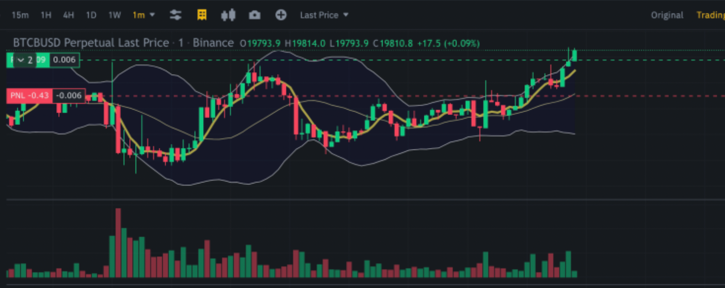
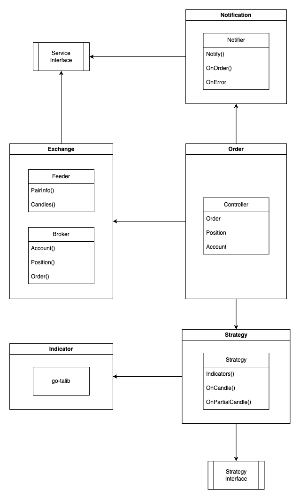

# Binance Futures Hedging Mode(Two-way) Trading Bot

---

This is a bot specialized for bidirectional trading in Binance futures trading. It's modular in form, allowing for flexible strategy application, and includes notification features such as Telegram, enabling quick responses. Also, because internal functions are abstracted, other exchanges besides Binance can be easily added.

### Not working yet



## Disclaimer
This software is for educational purposes only. Do not risk money which you are afraid to lose. USE THE SOFTWARE AT YOUR OWN RISK. THE AUTHORS AND ALL AFFILIATES ASSUME NO RESPONSIBILITY FOR YOUR TRADING RESULTS


## Install
```
./scripts/start.sh
```

## Features
- [x] Real-time cryptocurrency price update
- [x] Real-time order-book update
- [x] Notify via Telegram
- [x] Control settings via Telegram
- [x] Bidirectional trading
- [x] Account balance check
- [x] Open position order
- [x] Stop loss order
- [x] Take profit order
- [x] Trailing stop order
- [x] Trading settings from yaml file


## Structure




## Roadmap
- [ ] Trailing stop order
- [ ] Backtesting
- [ ] Chart UI
- [ ] Test coverage